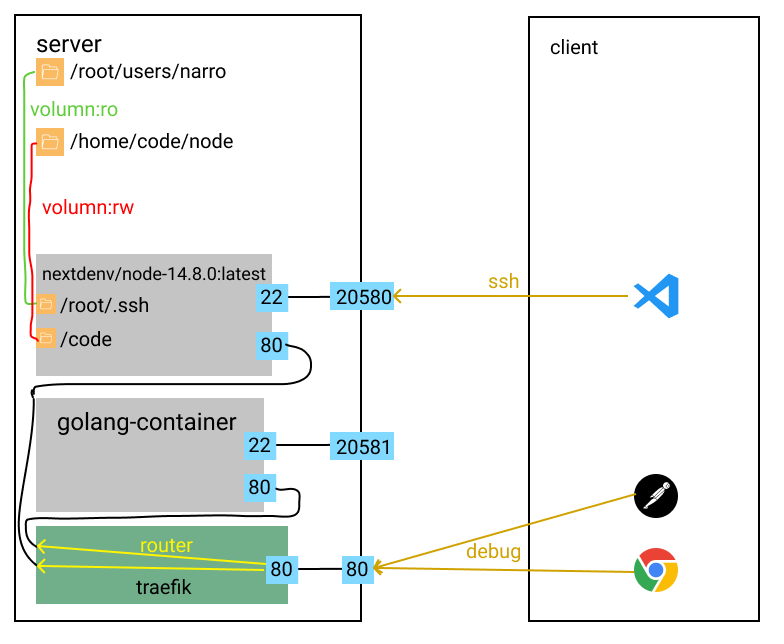

# 快速开始

## 准备工作
1. 一台装有docker环境的服务器，本文档以centos和node为例
2. 一台装有vscode的客户机

## 架构图


## 服务端配置
```shell
# 创建用户目录
$ mkdir -p /root/users/${username}
# 生成ssh key，这里的ssh_key是用来clone git repo的
$ ssh-keygen -q -f /root/users/${username}/id_rsa -N ""
$ cd /root/users/${username}
# 将客户端的ssh公钥加入到用户目录中，注意：这里的id_rsa.pub是客户机的ssh公钥
$ cat id_rsa.pub > authorized_keys
# 确保authorized_keys的权限正确
$ chmod 600 authorized_keys
# 生成代码目录
$ mkdir -p /home/code/node
# 启动docker container
$ docker run -v /root/users/narro:/root/.ssh:ro -v /home/code/node:/code:rw -p 20581:22 --name node-env nextdenv/node-14.8.0:latest
```
好了，到这里就可以用客户机上的vscode连接到我们的node容器了。

## traefik配置
接下来需要配置我们的边缘路由器traefik，为了调试我们的node项目。
```shell
# 启动traefik
$ docker run -v /var/run/docker.sock:/var/run/docker.sock:rw -v /home/data/traefik:/etc/traefik:rw -p 80:80 traefik
# 重新创建node container，为其加上label
$ docker stop node-env && docker rm node-env
$ docker run -v /root/users/narro:/root/.ssh:ro -v /home/code/node:/code:rw -p 20581:22 -l traefik.enable=true -l traefik.http.routers.node.entrypoints=web -l traefik.http.routers.node.rule=Host(`debug.com`) -l traefik.http.services.node.loadbalancer.server.port=80 --name node-env nextdenv/node-14.8.0:latest
```
```toml
# /home/data/traefik/traefik.toml
[global]
  checkNewVersion = true

[log]
  filePath = "/etc/traefik/logs/traefik.log"

[accessLog]
  filePath = "/etc/traefik/logs/access.log"

[providers]
  [providers.docker]
  exposedByDefault = false

[entryPoints]
  [entryPoints.web]
    address = ":80"
```
到这里，我们就能通过`debug.com`这个域名来访问我们node container里监听了80端口的服务了。

> 这里的域名视情况配置，我这里是内网环境，所以本地将`debug.com`这个域名解析到了我的server地址就可以了。